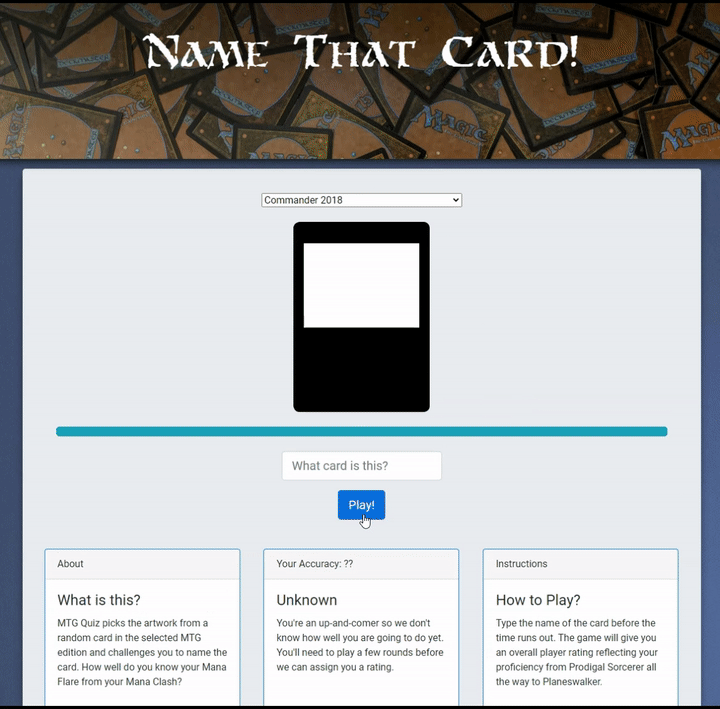
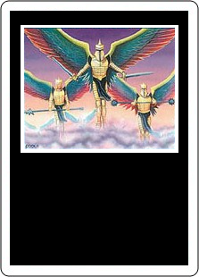
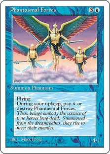

# Magic the Gathering Quizzer
A dynamically generated Magic the Gathering card guessing game where you have to guess the name of the card from the artwork. How well do you remember your Mana Flare from your Mana Clash?

## How does it work?

*First the game shows you a random card from the selected edition:*

*As the time ticks down, the progress bar will indicate remaining time. If the time runs out, or you give up, it will reveal the card.*

*After answering a set of questions, it will assign the player a ranking according to their proficiency.* 

You can also play the game online here:
[MTG Quiz](https://specularrealms.com/mtgquiz)

# TODO 

- [ ] Ability to post high-scores
- [ ] Account for on-screen keyboard for mobiles
- [X] Fix autocomplete on mobiles
- [X] Hyperlink canvas to link to WOTC site for card
